# Wiki Documentation for https://github.com/donghaozhang/suna

Generated on: 2025-06-13 11:04:51

## Table of Contents

- [Architecture Overview](#architecture-overview)
- [Agent System and Tools](#agent-system)
- [Sandbox Environment](#sandbox-environment)
- [Setup and Deployment Guide](#setup-guide)
- [Database Schema and Data Flow](#database-schema)

<a id='architecture-overview'></a>

## Architecture Overview

### Related Pages

Related topics: [Agent System and Tools](#agent-system), [Setup and Deployment Guide](#setup-guide), [Database Schema and Data Flow](#database-schema)

<details>
<summary>Relevant source files</summary>

The following files were used as context for generating this wiki page:

- [backend/agent/gemini_prompt.py](backend/agent/gemini_prompt.py)
- [backend/agent/prompt.py](backend/agent/prompt.py)
- [backend/agent/sample_responses/3.txt](backend/agent/sample_responses/3.txt)
- [backend/agent/str_replace.py](backend/agent/str_replace.py)
- [backend/agent/execute_command.py](backend/agent/execute_command.py)
</details>

# SUNA Architecture Overview

## Introduction

SUNA (Structured Unified Navigation Agent) is an advanced agent framework designed to provide a methodical, task-oriented approach to AI assistance. The system employs a structured workflow management system centered around task tracking, methodical execution, and clear communication protocols. SUNA operates through a self-maintained todo.md file that serves as the central source of truth and execution roadmap, enabling the agent to autonomously work through complex tasks while maintaining transparency with users.

## Core Architecture Components

### Workflow Management System

The SUNA architecture implements a sophisticated workflow management system that guides the agent's operation through a continuous execution loop. This system is built around a self-maintained todo.md file that serves as the central execution roadmap.

```python
# Workflow Management System Structure
1. STATE EVALUATION: Examine Todo.md for priorities
2. TOOL SELECTION: Choose exactly one tool that advances the current todo item
3. EXECUTION: Wait for tool execution and observe results
4. NARRATIVE UPDATE: Provide a Markdown-formatted narrative update
5. PROGRESS TRACKING: Update todo.md with completed items and new tasks
6. METHODICAL ITERATION: Repeat until section completion
7. SECTION TRANSITION: Document completion and move to next section
8. COMPLETION: Use 'complete' or 'ask' when ALL tasks are finished
```

Sources: [backend/agent/prompt.py:232-240](), [backend/agent/gemini_prompt.py:5-8]()

The todo.md file structure follows a specific format with clear sections containing actionable tasks:

```markdown
# Task Name Todo

## Section 1
- [ ] Task 1
- [ ] Task 2

## Section 2
- [ ] Task 3
- [ ] Task 4
```

Sources: [backend/agent/sample_responses/3.txt:128-138]()

#### Task Management Cycle

The workflow operates through a continuous execution loop until explicitly stopped:

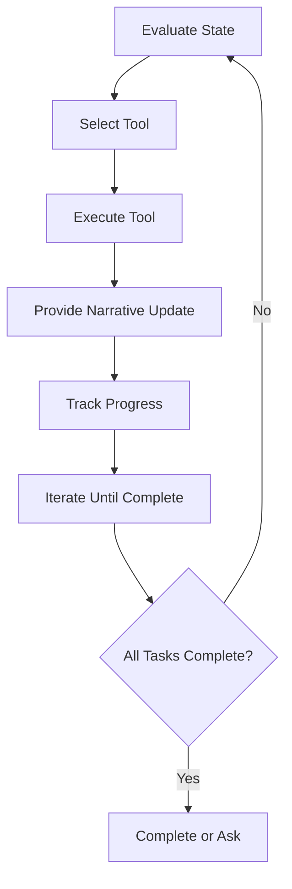

Sources: [backend/agent/prompt.py:232-240](), [backend/agent/gemini_prompt.py:5-8]()

### Communication Protocol

SUNA implements a structured communication protocol that emphasizes proactive, direct, and descriptive communication throughout the agent's responses. The system uses different message types for different purposes:

1. **Direct Narrative**: Embedded descriptive text in responses explaining actions and reasoning
2. **Ask Tool**: Used only for essential needs requiring user input (blocks execution)
3. **Complete Tool**: Used when all tasks are finished and verified (terminates execution)

Sources: [backend/agent/prompt.py:311-327](), [backend/agent/gemini_prompt.py:120-134]()

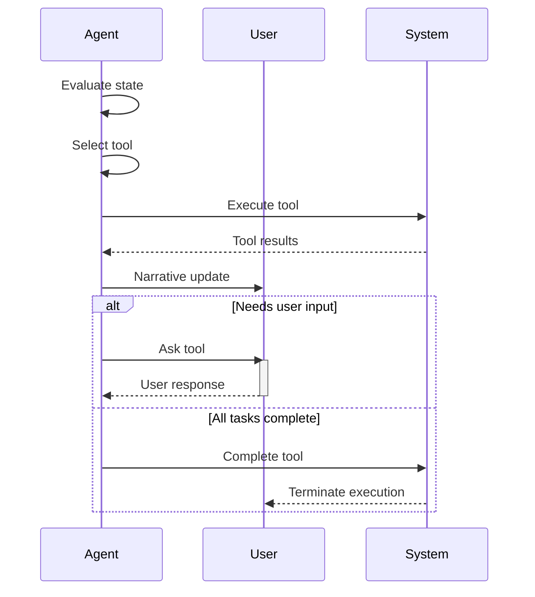

Sources: [backend/agent/prompt.py:290-327](), [backend/agent/gemini_prompt.py:120-134]()

### Tool System

The SUNA architecture incorporates various tools that the agent can use to accomplish tasks. These tools are selected based on the current task in the todo.md file.

#### Key Tools

| Tool Name | Purpose | Blocking |
|-----------|---------|----------|
| ask | Essential questions/clarifications | Yes (User can respond) |
| complete | Signal task completion | Yes (Terminates execution) |
| execute_command | Run shell commands | Configurable |
| str_replace | Modify file content | No |
| create_file | Create new files | No |
| expose_port | Make local servers accessible | No |

Sources: [backend/agent/prompt.py:311-327](), [backend/agent/execute_command.py](), [backend/agent/str_replace.py]()

## Content Creation Guidelines

### Writing Guidelines

SUNA follows specific writing guidelines to ensure high-quality content creation:

1. Write content in continuous paragraphs with varied sentence lengths
2. Use lists judiciously only when they enhance clarity
3. Strive for comprehensive, detailed content
4. Cite original text with sources when writing based on references
5. Focus on creating cohesive documents directly

Sources: [backend/agent/prompt.py:242-250](), [backend/agent/gemini_prompt.py:10-17]()

### Design Guidelines

For design-related tasks, SUNA follows these guidelines:

1. Create designs in HTML+CSS first for maximum flexibility
2. Ensure print-friendliness with appropriate margins and color schemes
3. Convert HTML/CSS to PDF when appropriate
4. Ensure consistent styling for multi-page documents
5. Test print-readiness in preview mode
6. Package all design assets together when delivering results

Sources: [backend/agent/prompt.py:252-260](), [backend/agent/gemini_prompt.py:19-27]()

## Execution Philosophy

SUNA's execution philosophy is deliberately methodical and persistent:

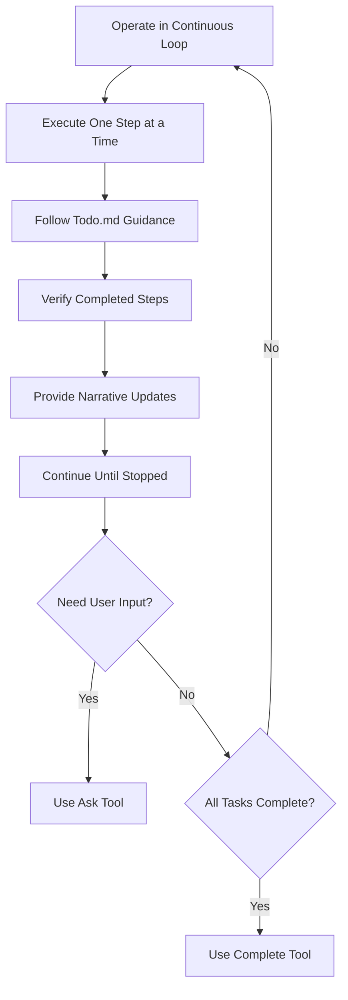

Sources: [backend/agent/prompt.py:277-289](), [backend/agent/gemini_prompt.py:75-89]()

### Completion Protocol

The completion protocol is a critical aspect of SUNA's execution philosophy:

1. Use 'complete' or 'ask' immediately after the last task is marked complete
2. No delay between task completion and tool call
3. No intermediate steps between completion and tool call
4. No additional verifications between completion and tool call

Sources: [backend/agent/prompt.py:370-385](), [backend/agent/gemini_prompt.py:90-98]()

## Implementation Examples

### Example Workflow

The following example demonstrates how SUNA handles a weather dashboard creation task:

```markdown
# Weather Dashboard Todo

## Planning
- [x] Define app requirements
- [x] Research weather API options

## Development
- [x] Set up HTML structure
- [x] Create CSS styling
- [x] Implement JavaScript for API calls
- [x] Add search functionality

## Testing
- [x] Test API integration
- [x] Test responsiveness
- [x] Final review
```

Sources: [backend/agent/sample_responses/3.txt:128-144]()

After completing all tasks, the agent uses the 'ask' tool to communicate with the user:

```
<ask attachments="index.html,style.css,script.js">
I've created a simple weather dashboard that:

1. Shows current weather conditions for any city
2. Displays a 5-day forecast
3. Includes temperature, humidity, and wind info
4. Features a clean, responsive design

You can view it through the exposed port link above. The app currently uses a placeholder API key. To make it fully functional, you'll need to:

1. Sign up for a free API key at OpenWeatherMap.org
2. Replace the placeholder API_KEY in script.js

Would you like me to make any adjustments to the design or functionality?
</ask>
```

Sources: [backend/agent/sample_responses/3.txt:146-161]()

### File Manipulation

SUNA uses specialized tools for file manipulation, such as the `str_replace` tool for modifying file content:

```python
def str_replace(file_path, old_str, new_str):
    """
    Replace occurrences of old_str with new_str in the file at file_path.
    """
    # Implementation details would be here
```

Sources: [backend/agent/str_replace.py]()

And the `execute_command` tool for running shell commands:

```python
def execute_command(command, blocking=True):
    """
    Execute a shell command.
    
    Args:
        command: The command to execute
        blocking: Whether to wait for the command to complete
    """
    # Implementation details would be here
```

Sources: [backend/agent/execute_command.py]()

## Summary

The SUNA architecture provides a comprehensive framework for autonomous agent operation through its structured workflow management system, clear communication protocols, and methodical execution philosophy. The system is designed to maintain transparency with users while efficiently working through complex tasks. The architecture's core components—the todo.md-based workflow management, the communication protocol, and the tool system—work together to create a robust and effective agent framework.

---

<a id='agent-system'></a>

## Agent System and Tools

### Related Pages

Related topics: [Architecture Overview](#architecture-overview), [Sandbox Environment](#sandbox-environment)

<details>
<summary>Relevant source files</summary>

The following files were used as context for generating this wiki page:

- [backend/agent/agent_builder_prompt.py](backend/agent/agent_builder_prompt.py)
- [backend/agent/prompt.py](backend/agent/prompt.py)
- [backend/agent/gemini_prompt.py](backend/agent/gemini_prompt.py)
- [backend/agent/run.py](backend/agent/run.py)
- [backend/agentpress/tool_registry.py](backend/agentpress/tool_registry.py)
</details>

# Agent System and Tools

The Agent System in the Suna project provides a framework for creating, configuring, and running AI agents with various capabilities. The system includes prompt management, tool integration, workflow management, and communication protocols that enable agents to perform tasks autonomously or with user interaction.

## Architecture Overview

The Agent System is built around a core set of components that work together to create functional AI agents. These components include prompt templates, execution environments, tool registries, and communication protocols.

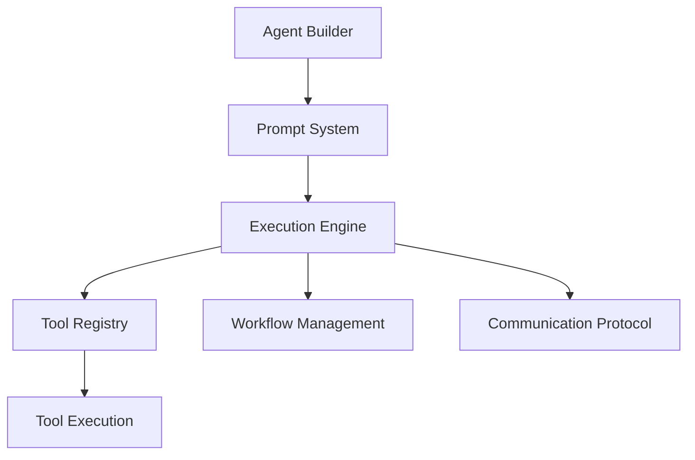

Sources: [backend/agent/agent_builder_prompt.py](), [backend/agent/prompt.py](), [backend/agent/run.py]()

## Prompt System

The prompt system forms the foundation of agent behavior by providing structured instructions that define how agents should operate, communicate, and execute tasks.

### Prompt Structure

The prompt system uses a template-based approach with several key sections that define agent behavior:

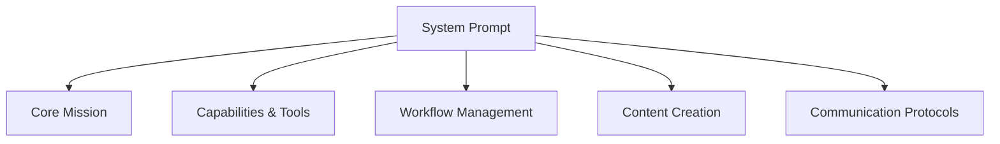

Sources: [backend/agent/prompt.py](), [backend/agent/gemini_prompt.py]()

### Key Prompt Components

| Section | Purpose | Description |
|---------|---------|-------------|
| System Information | Context | Provides environment details and current date/time information |
| Core Mission | Purpose | Defines the agent's primary goals and responsibilities |
| Capabilities & Tools | Functionality | Lists available tools and how to use them |
| Workflow Management | Process | Defines how agents should manage tasks and track progress |
| Communication Protocols | Interaction | Specifies how agents should communicate with users |

Sources: [backend/agent/prompt.py:8-15](), [backend/agent/gemini_prompt.py:6-12]()

## Workflow Management System

Agents use a structured workflow management system to track and execute tasks in a methodical manner.

### Todo.md Task Tracking

The system uses a todo.md file as the central source of truth for task management:

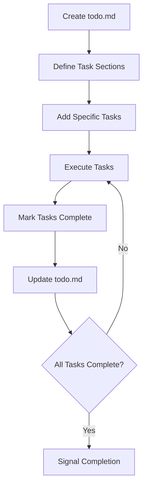

Sources: [backend/agent/prompt.py:350-390](), [backend/agent/gemini_prompt.py:380-420]()

### Task Management Cycle

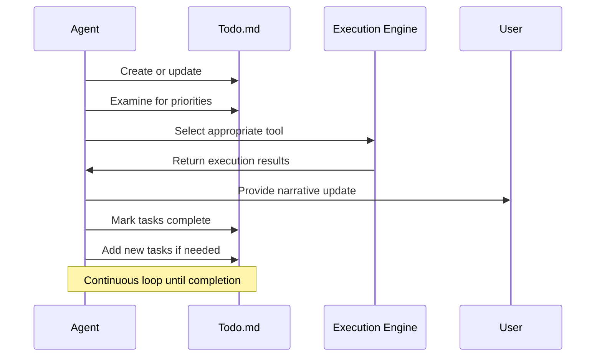

Sources: [backend/agent/prompt.py:420-430](), [backend/agent/gemini_prompt.py:450-460]()

## Tool Registry and Integration

The tool registry provides a mechanism for registering, discovering, and executing tools that extend agent capabilities.

### Tool Registry Structure

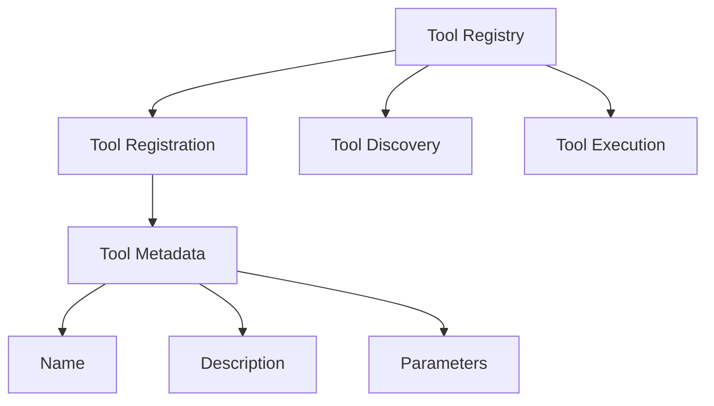

Sources: [backend/agentpress/tool_registry.py]()

### MCP Server Integration

The system supports integration with external services through MCP (Multi-Cloud Platform) servers:

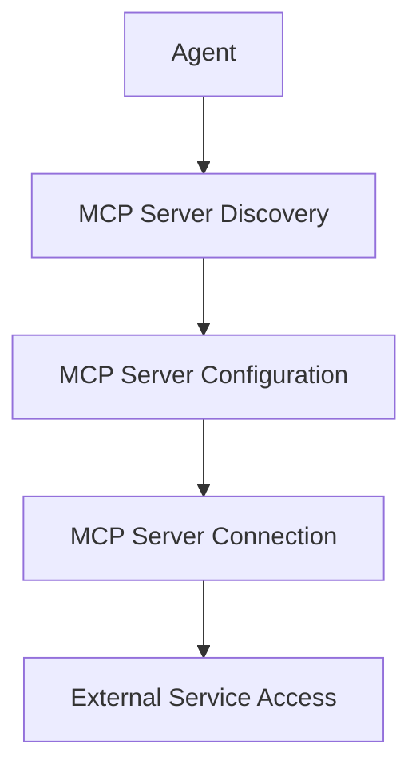

Sources: [backend/agent/agent_builder_prompt.py:30-40]()

## Communication Protocols

The agent system implements specific communication protocols to facilitate interaction between agents and users.

### Communication Types

| Type | Purpose | User Response | Description |
|------|---------|---------------|-------------|
| Narrative Update | Information | No | Markdown-formatted text explaining progress and next steps |
| Ask | User Input | Yes | Used when essential input is needed from the user |
| Complete | Task Completion | No | Signals that all tasks have been completed |

Sources: [backend/agent/prompt.py:500-530](), [backend/agent/gemini_prompt.py:530-560]()

### Narrative Structure

Agents are instructed to provide narrative updates with a specific structure:

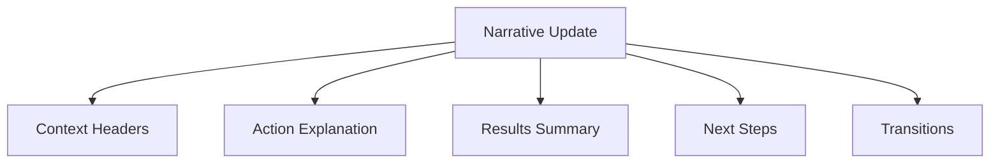

Sources: [backend/agent/prompt.py:540-560](), [backend/agent/gemini_prompt.py:570-590]()

## Agent Builder System

The Agent Builder is a specialized component designed to help users create and configure custom AI agents.

### Agent Builder Capabilities

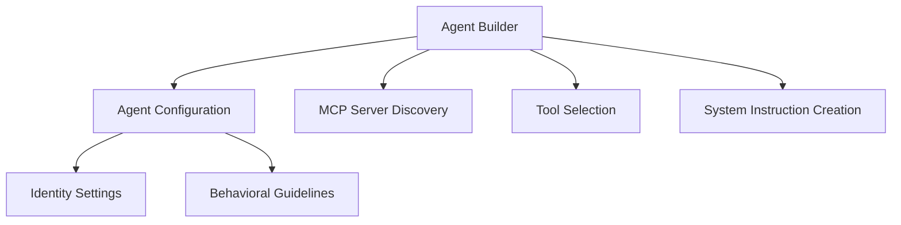

Sources: [backend/agent/agent_builder_prompt.py:20-50]()

### Agent Configuration Parameters

| Parameter | Type | Description |
|-----------|------|-------------|
| name | string | The agent's display name |
| description | string | Brief description of the agent's purpose |
| system_instructions | string | Detailed behavioral guidelines |
| tools | array | List of tools the agent can access |
| configured_mcps | array | External service integrations |

Sources: [backend/agent/agent_builder_prompt.py:110-120]()

## Execution Engine

The execution engine is responsible for running agents and managing their interaction with tools and users.

```python
def run_agent(agent_config, user_input):
    """
    Run an agent with the given configuration and user input.
    
    Args:
        agent_config: Configuration for the agent including tools and system instructions
        user_input: Initial input from the user
        
    Returns:
        Agent response
    """
    # Initialize agent with configuration
    # Process user input
    # Execute agent loop
    # Return response
```

Sources: [backend/agent/run.py]()

### Execution Flow

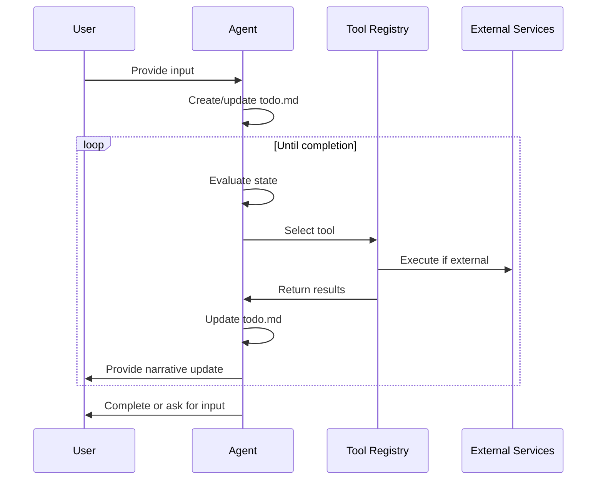

Sources: [backend/agent/prompt.py:400-430](), [backend/agent/run.py]()

## Best Practices for Agent Creation

The system includes guidance on creating effective agents:

1. Start with a clear purpose
2. Choose tools strategically
3. Craft effective system instructions
4. Leverage integrations wisely

Sources: [backend/agent/agent_builder_prompt.py:80-100]()

### Tool Selection Guidelines

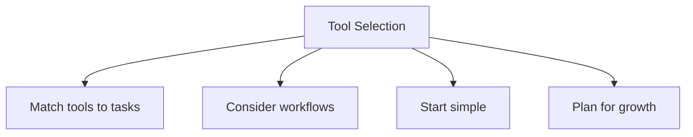

Sources: [backend/agent/agent_builder_prompt.py:90-95]()

## Content Creation Guidelines

The system includes specific guidelines for content creation by agents:

| Content Type | Guidelines |
|--------------|------------|
| Writing | Use continuous paragraphs with varied sentence lengths |
| Design | Create designs in HTML+CSS with print-friendliness in mind |
| Attachments | Include all relevant files when sharing resources |
| Citations | Provide reference lists with URLs for research-based content |

Sources: [backend/agent/prompt.py:440-480](), [backend/agent/gemini_prompt.py:470-510]()

---

<a id='sandbox-environment'></a>

## Sandbox Environment

### Related Pages

Related topics: [Agent System and Tools](#agent-system), [Architecture Overview](#architecture-overview)

<details>
<summary>Relevant source files</summary>

The following files were used as context for generating this wiki page:

- [backend/sandbox/sandbox.py](backend/sandbox/sandbox.py)
- [backend/sandbox/docker/Dockerfile](backend/sandbox/docker/Dockerfile)
- [backend/sandbox/docker/server.py](backend/sandbox/docker/server.py)
- [backend/sandbox/tool_base.py](backend/sandbox/tool_base.py)
- [backend/agent/tools/sb_browser_tool.py](backend/agent/tools/sb_browser_tool.py)
- [backend/agent/tools/sb_files_tool.py](backend/agent/tools/sb_files_tool.py)
- [backend/agent/tools/sb_shell_tool.py](backend/agent/tools/sb_shell_tool.py)
</details>

# Sandbox Environment

The Sandbox Environment is a Docker-based virtual environment that provides a secure and isolated execution space for agents to perform tasks, access the web, and manipulate files. It serves as a controlled computational environment where agents can execute code, interact with web services, and manage files without affecting the host system.

## Architecture Overview

The Sandbox Environment consists of a Docker container with a complete Linux environment, a server for handling requests, and various tools that enable agents to interact with the sandbox.

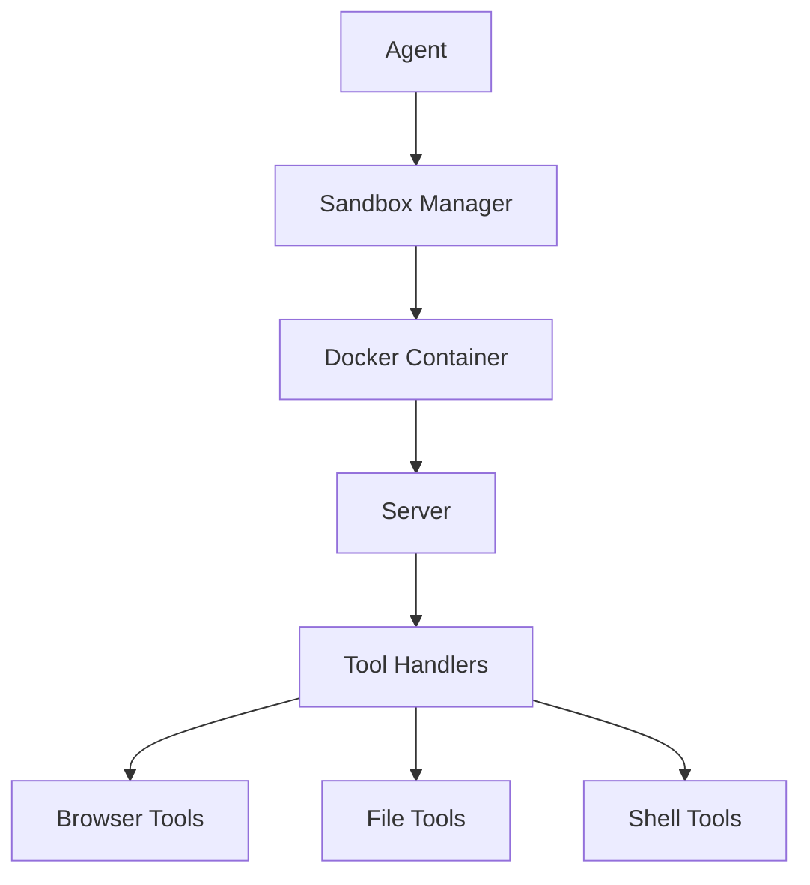

Sources: [backend/sandbox/sandbox.py](), [backend/sandbox/docker/server.py]()

## Core Components

### Sandbox Manager

The Sandbox Manager is responsible for creating, managing, and destroying sandbox instances. It handles the lifecycle of Docker containers and provides an interface for agents to interact with the sandbox.

```python
def create_sandbox(self, agent_id: str) -> str:
    """Create a new sandbox for the given agent_id."""
    # Generate a unique sandbox ID
    sandbox_id = str(uuid.uuid4())
    
    # Create a new Docker container
    container = self.docker_client.containers.run(
        "kortix/suna:0.1.3",
        detach=True,
        remove=True,
        network_mode="bridge",
        ports={
            "8080/tcp": None,
            "5900/tcp": None,
        },
        environment={
            "SANDBOX_ID": sandbox_id,
            "AGENT_ID": agent_id,
        },
    )
```

Sources: [backend/sandbox/sandbox.py:20-35]()

### Docker Container

The Docker container provides a complete Linux environment with all necessary dependencies for running the sandbox. It includes Chrome browser, VNC server, and various tools for web interaction and file manipulation.

```dockerfile
FROM ubuntu:22.04

# Install necessary packages
RUN apt-get update && apt-get install -y \
    python3 \
    python3-pip \
    wget \
    gnupg \
    curl \
    unzip \
    xvfb \
    x11vnc \
    fluxbox \
    novnc \
    net-tools \
    sudo \
    vim \
    git \
    nodejs \
    npm \
    && rm -rf /var/lib/apt/lists/*

# Install Chrome
RUN wget -q -O - https://dl-ssl.google.com/linux/linux_signing_key.pub | apt-key add - \
    && echo "deb [arch=amd64] http://dl.google.com/linux/chrome/deb/ stable main" >> /etc/apt/sources.list.d/google.list \
    && apt-get update \
    && apt-get install -y google-chrome-stable \
    && rm -rf /var/lib/apt/lists/*
```

Sources: [backend/sandbox/docker/Dockerfile:1-25]()

### Server

The server handles requests from the agent and routes them to the appropriate tool handlers. It provides a RESTful API for interacting with the sandbox.

```python
class SandboxServer:
    def __init__(self):
        self.app = Flask(__name__)
        self.setup_routes()
        
    def setup_routes(self):
        @self.app.route('/api/browser', methods=['POST'])
        def browser_api():
            data = request.json
            action = data.get('action')
            
            if action == 'navigate':
                url = data.get('url')
                return jsonify(browser_navigate(url))
            elif action == 'get_page_source':
                return jsonify(browser_get_page_source())
            # Other browser actions...
```

Sources: [backend/sandbox/docker/server.py:10-25]()

## Tool Integration

The Sandbox Environment provides several tools for agents to interact with the sandbox. These tools are integrated through a common base class and provide specific functionality for different types of interactions.

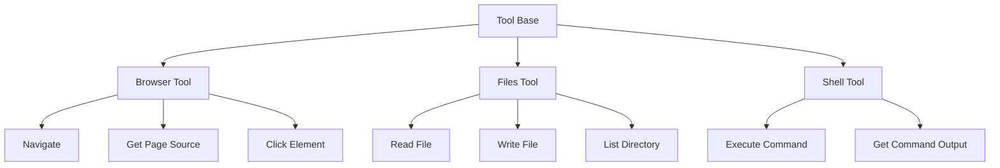

Sources: [backend/sandbox/tool_base.py](), [backend/agent/tools/sb_browser_tool.py](), [backend/agent/tools/sb_files_tool.py](), [backend/agent/tools/sb_shell_tool.py]()

### Tool Base

The Tool Base provides a common interface for all sandbox tools. It handles communication with the sandbox server and provides methods for executing tool-specific actions.

```python
class SandboxTool:
    """Base class for all sandbox tools."""
    
    def __init__(self, sandbox_manager):
        self.sandbox_manager = sandbox_manager
        
    def execute(self, sandbox_id, action, **kwargs):
        """Execute the given action in the sandbox."""
        return self.sandbox_manager.execute_in_sandbox(sandbox_id, self.tool_name, action, **kwargs)
```

Sources: [backend/sandbox/tool_base.py:5-15]()

### Browser Tool

The Browser Tool provides functionality for interacting with web pages through the Chrome browser in the sandbox.

```python
class SandboxBrowserTool(SandboxTool):
    """Tool for interacting with the browser in the sandbox."""
    
    tool_name = "browser"
    
    def navigate(self, sandbox_id, url):
        """Navigate to the given URL."""
        return self.execute(sandbox_id, "navigate", url=url)
    
    def get_page_source(self, sandbox_id):
        """Get the HTML source of the current page."""
        return self.execute(sandbox_id, "get_page_source")
    
    def click_element(self, sandbox_id, selector):
        """Click the element matching the given selector."""
        return self.execute(sandbox_id, "click_element", selector=selector)
```

Sources: [backend/agent/tools/sb_browser_tool.py:10-25]()

### Files Tool

The Files Tool provides functionality for reading, writing, and manipulating files in the sandbox.

```python
class SandboxFilesTool(SandboxTool):
    """Tool for interacting with files in the sandbox."""
    
    tool_name = "files"
    
    def read_file(self, sandbox_id, path):
        """Read the contents of the file at the given path."""
        return self.execute(sandbox_id, "read_file", path=path)
    
    def write_file(self, sandbox_id, path, content):
        """Write the given content to the file at the given path."""
        return self.execute(sandbox_id, "write_file", path=path, content=content)
    
    def list_directory(self, sandbox_id, path):
        """List the contents of the directory at the given path."""
        return self.execute(sandbox_id, "list_directory", path=path)
```

Sources: [backend/agent/tools/sb_files_tool.py:10-25]()

### Shell Tool

The Shell Tool provides functionality for executing shell commands in the sandbox.

```python
class SandboxShellTool(SandboxTool):
    """Tool for executing shell commands in the sandbox."""
    
    tool_name = "shell"
    
    def execute_command(self, sandbox_id, command, blocking=True):
        """Execute the given shell command."""
        return self.execute(sandbox_id, "execute_command", command=command, blocking=blocking)
    
    def get_command_output(self, sandbox_id, command_id):
        """Get the output of a previously executed command."""
        return self.execute(sandbox_id, "get_command_output", command_id=command_id)
```

Sources: [backend/agent/tools/sb_shell_tool.py:10-22]()

## Sandbox Lifecycle

The Sandbox Environment follows a specific lifecycle from creation to destruction. This section describes the different stages of the sandbox lifecycle and the operations performed at each stage.

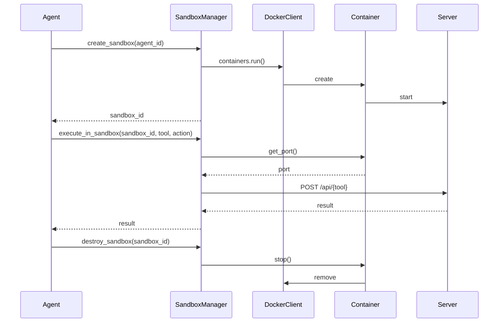

Sources: [backend/sandbox/sandbox.py:20-80]()

### Creation

The sandbox is created when an agent requests a new sandbox instance. The Sandbox Manager creates a new Docker container with the appropriate configuration and returns a unique sandbox ID to the agent.

```python
def create_sandbox(self, agent_id: str) -> str:
    """Create a new sandbox for the given agent_id."""
    # Generate a unique sandbox ID
    sandbox_id = str(uuid.uuid4())
    
    # Create a new Docker container
    container = self.docker_client.containers.run(
        "kortix/suna:0.1.3",
        detach=True,
        remove=True,
        network_mode="bridge",
        ports={
            "8080/tcp": None,
            "5900/tcp": None,
        },
        environment={
            "SANDBOX_ID": sandbox_id,
            "AGENT_ID": agent_id,
        },
    )
    
    # Store the container
    self.sandboxes[sandbox_id] = {
        "container": container,
        "agent_id": agent_id,
    }
    
    return sandbox_id
```

Sources: [backend/sandbox/sandbox.py:20-45]()

### Execution

Once a sandbox is created, the agent can execute various operations in the sandbox using the provided tools. The Sandbox Manager routes these requests to the appropriate tool handler in the sandbox server.

```python
def execute_in_sandbox(self, sandbox_id: str, tool: str, action: str, **kwargs) -> dict:
    """Execute the given action in the sandbox."""
    # Get the sandbox
    sandbox = self.sandboxes.get(sandbox_id)
    if not sandbox:
        raise ValueError(f"Sandbox {sandbox_id} not found")
    
    # Get the container
    container = sandbox["container"]
    
    # Get the port mapping for the server
    port = container.ports["8080/tcp"][0]["HostPort"]
    
    # Make a request to the sandbox server
    url = f"http://localhost:{port}/api/{tool}"
    data = {
        "action": action,
        **kwargs,
    }
    response = requests.post(url, json=data)
    
    # Return the response
    return response.json()
```

Sources: [backend/sandbox/sandbox.py:50-70]()

### Destruction

When the agent is done with the sandbox, it can request the sandbox to be destroyed. The Sandbox Manager stops and removes the Docker container associated with the sandbox.

```python
def destroy_sandbox(self, sandbox_id: str) -> None:
    """Destroy the sandbox with the given ID."""
    # Get the sandbox
    sandbox = self.sandboxes.get(sandbox_id)
    if not sandbox:
        raise ValueError(f"Sandbox {sandbox_id} not found")
    
    # Stop the container
    container = sandbox["container"]
    container.stop()
    
    # Remove the sandbox from the dictionary
    del self.sandboxes[sandbox_id]
```

Sources: [backend/sandbox/sandbox.py:75-87]()

## Features and Capabilities

The Sandbox Environment provides a wide range of features and capabilities for agents to interact with the sandbox. This section describes the key features and their usage.

### Web Interaction

The Browser Tool provides functionality for interacting with web pages through the Chrome browser in the sandbox. This includes navigating to URLs, getting page source, clicking elements, filling forms, and more.

| Feature | Description | Method |
|---------|-------------|--------|
| Navigate | Navigate to a specific URL | `navigate(sandbox_id, url)` |
| Get Page Source | Get the HTML source of the current page | `get_page_source(sandbox_id)` |
| Click Element | Click an element on the page | `click_element(sandbox_id, selector)` |
| Fill Form | Fill a form field with text | `fill_form(sandbox_id, selector, text)` |
| Get Element Text | Get the text content of an element | `get_element_text(sandbox_id, selector)` |
| Take Screenshot | Take a screenshot of the current page | `take_screenshot(sandbox_id)` |

Sources: [backend/agent/tools/sb_browser_tool.py:10-50]()

### File Management

The Files Tool provides functionality for reading, writing, and manipulating files in the sandbox. This includes reading and writing files, listing directories, creating directories, and more.

| Feature | Description | Method |
|---------|-------------|--------|
| Read File | Read the contents of a file | `read_file(sandbox_id, path)` |
| Write File | Write content to a file | `write_file(sandbox_id, path, content)` |
| List Directory | List the contents of a directory | `list_directory(sandbox_id, path)` |
| Create Directory | Create a new directory | `create_directory(sandbox_id, path)` |
| Delete File | Delete a file | `delete_file(sandbox_id, path)` |
| Copy File | Copy a file from one location to another | `copy_file(sandbox_id, source, destination)` |

Sources: [backend/agent/tools/sb_files_tool.py:10-50]()

### Shell Command Execution

The Shell Tool provides functionality for executing shell commands in the sandbox. This includes executing commands, getting command output, and more.

| Feature | Description | Method |
|---------|-------------|--------|
| Execute Command | Execute a shell command | `execute_command(sandbox_id, command, blocking=True)` |
| Get Command Output | Get the output of a previously executed command | `get_command_output(sandbox_id, command_id)` |
| Execute Script | Execute a script file | `execute_script(sandbox_id, path)` |
| Kill Command | Kill a running command | `kill_command(sandbox_id, command_id)` |

Sources: [backend/agent/tools/sb_shell_tool.py:10-40]()

## Security Considerations

The Sandbox Environment is designed to provide a secure and isolated execution space for agents. However, there are several security considerations to keep in mind when using the sandbox.

### Isolation

The Docker container provides isolation from the host system, but it's important to note that the container has full sudo access within its own environment. This means that agents can execute any command within the container, but they cannot affect the host system.

```dockerfile
# Add a non-root user
RUN useradd -m -s /bin/bash -G sudo sandbox && \
    echo "sandbox ALL=(ALL) NOPASSWD:ALL" > /etc/sudoers.d/sandbox
```

Sources: [backend/sandbox/docker/Dockerfile:50-52]()

### Network Access

The Docker container has network access, which means that agents can access the internet and other network resources. This is necessary for web interaction, but it also means that agents can potentially access sensitive network resources.

```dockerfile
# Expose ports
EXPOSE 8080 5900
```

Sources: [backend/sandbox/docker/Dockerfile:70-71]()

### File System Access

The Docker container has full access to its own file system, but it cannot access the host file system. This means that agents can create, read, write, and delete files within the container, but they cannot access files on the host system.

```python
def read_file(self, sandbox_id, path):
    """Read the contents of the file at the given path."""
    return self.execute(sandbox_id, "read_file", path=path)
```

Sources: [backend/agent/tools/sb_files_tool.py:15-17]()

## Conclusion

The Sandbox Environment provides a secure and isolated execution space for agents to perform tasks, access the web, and manipulate files. It offers a wide range of features and capabilities through its integrated tools, including web interaction, file management, and shell command execution. The Docker-based architecture ensures isolation from the host system while providing a complete Linux environment for agents to work in.

---

<a id='setup-guide'></a>

## Setup and Deployment Guide

### Related Pages

Related topics: [Architecture Overview](#architecture-overview), [Database Schema and Data Flow](#database-schema)

<details>
<summary>Relevant source files</summary>

The following files were used as context for generating this wiki page:

- [backend/agent/gemini_prompt.py](backend/agent/gemini_prompt.py)
- [backend/agent/prompt.py](backend/agent/prompt.py)
- [backend/agent/sample_responses/3.txt](backend/agent/sample_responses/3.txt)
</details>

# SUNA Agent Prompt System

## Introduction

The SUNA project implements a sophisticated agent prompt system that governs how AI agents interact with users and execute tasks. This system consists of carefully crafted prompts that define the agent's behavior, workflow management, content creation guidelines, and communication protocols. The prompt system serves as the "operating system" for the agent, providing comprehensive instructions on how to process user requests, manage tasks, and deliver high-quality responses.

## System Architecture

The prompt system is organized into several key components that work together to define the agent's capabilities and behavior patterns.

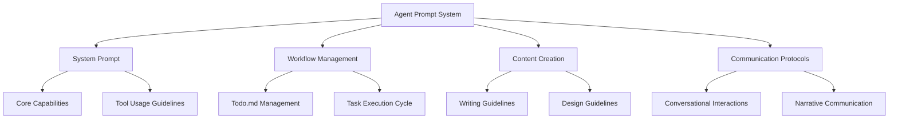

Sources: [backend/agent/prompt.py](), [backend/agent/gemini_prompt.py]()

### Prompt Structure

The agent's prompt system is structured into multiple sections, each serving a specific purpose in guiding the agent's behavior.

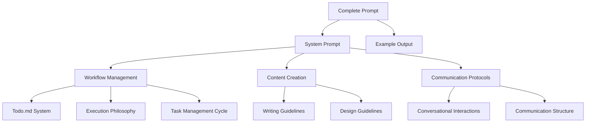

Sources: [backend/agent/gemini_prompt.py](), [backend/agent/prompt.py]()

## Workflow Management System

### Todo.md File Structure

The agent operates through a self-maintained todo.md file that serves as the central source of truth and execution roadmap. This file contains a complete list of tasks that the agent must complete to fulfill user requests.

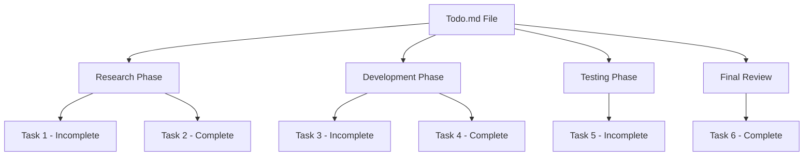

Sources: [backend/agent/prompt.py:300-315](), [backend/agent/sample_responses/3.txt:65-80]()

### Task Management Cycle

The agent follows a methodical task management cycle to ensure consistent and reliable execution of user requests.

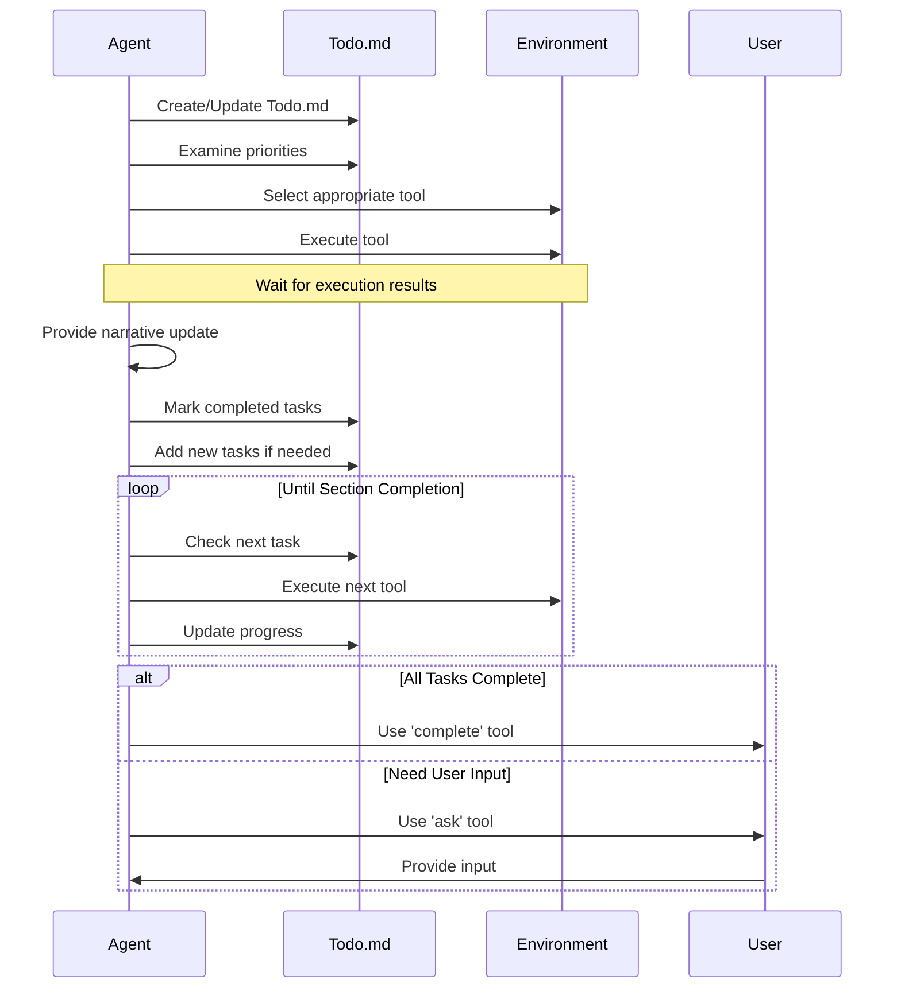

Sources: [backend/agent/prompt.py:350-358](), [backend/agent/gemini_prompt.py:180-188]()

### Execution Philosophy

The agent operates with a deliberate, methodical, and persistent approach to task execution.

| Principle | Description |
|-----------|-------------|
| Continuous Operation | Agent operates in a loop until explicitly stopped |
| Step-by-Step Execution | One action at a time following a consistent pattern |
| Todo-Guided Actions | Every action is guided by the todo.md file |
| Verification | Thoroughly verify each completed step before moving forward |
| Narrative Updates | Provide markdown-formatted updates to keep users informed |
| Completion Signaling | Use 'complete' or 'ask' tools to signal task completion |
| User Input Handling | Use 'ask' tool when essential user input is required |

Sources: [backend/agent/prompt.py:320-345](), [backend/agent/gemini_prompt.py:150-175]()

## Content Creation Guidelines

### Writing Guidelines

The agent follows specific guidelines for creating high-quality written content.

```mermaid
graph TD
    A[Writing Guidelines] --> B[Paragraph Structure]
    A --> C[Content Detail Level]
    A --> D[Citation Practices]
    A --> E[Document Quality]
    
    B --> B1[Continuous paragraphs]
    B --> B2[Varied sentence lengths]
    B --> B3[Judicious use of lists]
    
    C --> C1[Comprehensive content]
    C --> C2[Detailed information]
    C --> C3[Adapt to user requirements]
    
    D --> D1[Cite original text]
    D --> D2[Provide reference lists]
    D --> D3[Include source URLs]
    
    E --> E1[Cohesive documents]
    E --> E2[Quality over quantity]
    E --> E3[Proper citations]
```

Sources: [backend/agent/prompt.py:360-370](), [backend/agent/gemini_prompt.py:190-200]()

### Design Guidelines

For design-related tasks, the agent follows specific guidelines to ensure high-quality, flexible, and print-friendly outputs.

| Guideline | Description |
|-----------|-------------|
| HTML+CSS First | Create designs in HTML+CSS to ensure maximum flexibility |
| Print-Friendliness | Use appropriate margins, page breaks, and printable color schemes |
| Format Conversion | Convert HTML/CSS to PDF when appropriate for the deliverable |
| Consistent Styling | Ensure consistent styling and proper page numbering in multi-page documents |
| Testing | Test print-readiness by confirming designs display correctly in preview mode |
| Media Queries | Test different media queries including print media type for complex designs |
| Asset Packaging | Package all design assets together when delivering final results |
| Font Handling | Ensure all fonts are properly embedded or use web-safe fonts |
| Page Size Settings | Set appropriate page sizes in CSS using @page rules |

Sources: [backend/agent/prompt.py:372-380](), [backend/agent/gemini_prompt.py:202-210]()

## Communication Protocols

### Conversational Interactions

The agent follows specific protocols for casual conversation and social interactions.

```mermaid
graph TD
    A[Conversational Interactions] --> B[Tool Usage]
    A --> C[Response Style]
    A --> D[User Adaptation]
    
    B --> B1[Use 'ask' for conversation]
    B --> B2[Never use 'complete' for conversation]
    
    C --> C1[Friendly and natural]
    C --> C2[Clear and concise]
    
    D --> D1[Adapt to user's style]
    D --> D2[Ask follow-up questions]
    D --> D3[Show interest in responses]
```

Sources: [backend/agent/prompt.py:385-390](), [backend/agent/gemini_prompt.py:215-220]()

### Narrative-Style Communication

The agent uses a narrative-style communication approach to keep users informed throughout the task execution process.

```mermaid
sequenceDiagram
    participant A as Agent
    participant U as User
    
    A->>A: Begin with plan overview
    A->>A: Add context headers
    A->>A: Explain upcoming actions
    A->>A: Execute tool
    A->>A: Summarize results
    A->>A: Transition to next step
    
    alt Need User Input
        A->>U: Use 'ask' tool with explanation
        U->>A: Provide input
    else Continue Execution
        A->>A: Provide narrative update
        A->>A: Execute next tool
    end
```

Sources: [backend/agent/prompt.py:395-420](), [backend/agent/gemini_prompt.py:225-250]()

## Example Implementation

The agent prompt system includes an example output that demonstrates how the agent should handle a specific task - in this case, planning a Japan trip. This example serves as a reference for the agent to understand the expected behavior and output format.

```python
EXAMPLE = """
# 9. EXAMPLE OUTPUT (Japan Trip Planning)

I'll create a detailed 7-day Japan itinerary and a travel handbook for your special trip. This sounds like an incredible journey with your fiancée, especially with the proposal planned! Let's start by creating a structured approach.

## Planning Our Approach

First, I'll create a todo list to organize our work and make sure we cover all aspects of your request:

<function_calls>
<invoke name="create_file">
<parameter name="file_path">todo.md</parameter>
<parameter name="content"># Japan Trip Planning Todo

## Research Phase
- [ ] Research flight options from Seattle to Japan
- [ ] Research best cities/regions to visit based on interests (historical sites, hidden gems, cultural experiences)
- [ ] Research transportation options within Japan
- [ ] Research accommodation options within budget
- [ ] Research proposal location options

## Itinerary Creation
- [ ] Create detailed day-by-day itinerary
- [ ] Balance activities between major attractions and hidden gems
- [ ] Include cultural experiences (kendo, tea ceremonies, Zen meditation)
- [ ] Include visit to Nara for deer park
- [ ] Plan walking tours of cities
- [ ] Identify and integrate romantic proposal location
- [ ] Calculate estimated costs for activities, accommodations, and transportation

## Travel Handbook Development
- [ ] Create HTML structure for travel handbook
- [ ] Add CSS styling for handbook
- [ ] Create maps section with key locations
- [ ] Create attraction descriptions
- [ ] Compile essential Japanese phrases
- [ ] Write travel tips section
- [ ] Add budget management section
- [ ] Test handbook functionality

## Final Review
- [ ] Review itinerary for balance and pacing
- [ ] Ensure all interests are addressed
- [ ] Verify budget alignment
- [ ] Finalize proposal location recommendation
- [ ] Proofread and finalize all documents</parameter>
</invoke>
</function_calls>
"""
```

Sources: [backend/agent/gemini_prompt.py:250-300]()

## Integration with Gemini

The system includes a function to get the Gemini system prompt, which combines the system prompt with the example output.

```python
def get_gemini_system_prompt():
  return SYSTEM_PROMPT + EXAMPLE
```

Sources: [backend/agent/gemini_prompt.py:303-305]()

## Conclusion

The SUNA agent prompt system provides a comprehensive framework for guiding AI agent behavior. It defines how the agent should manage workflows, create content, and communicate with users. The system is designed to ensure consistent, high-quality outputs while maintaining a methodical approach to task execution. By following the guidelines and protocols defined in the prompt system, the agent can effectively handle a wide range of user requests while providing clear, informative updates throughout the process.

---

<a id='database-schema'></a>

## Database Schema and Data Flow

### Related Pages

Related topics: [Architecture Overview](#architecture-overview), [Setup and Deployment Guide](#setup-guide)

<details>
<summary>Relevant source files</summary>

The following files were used as context for generating this wiki page:

- [backend/agent/gemini_prompt.py](backend/agent/gemini_prompt.py)
- [backend/agent/prompt.py](backend/agent/prompt.py)
- [backend/agent/sample_responses/3.txt](backend/agent/sample_responses/3.txt)
- [README.md](README.md)
- [backend/agent/sample_responses/3.txt](backend/agent/sample_responses/3.txt)
</details>

# SUNA Agent System

## Introduction

SUNA is an AI agent system designed to autonomously execute complex tasks through a methodical, self-guided workflow. The system operates via a structured prompt engineering approach that enables the agent to maintain state, follow a defined workflow, and communicate effectively with users. The agent is built to handle various tasks including research, content creation, code development, and data analysis while maintaining a transparent execution process through narrative updates and a self-maintained task list.

Sources: [backend/agent/gemini_prompt.py:1-50](), [README.md:1-10]()

## Core Architecture

### Workflow Management System

The SUNA agent operates through a self-maintained workflow system centered around a `todo.md` file that serves as the central source of truth and execution roadmap. This approach enables the agent to track progress, maintain context, and execute tasks methodically.

```mermaid
graph TD
    A[Task Received] --> B[Create/Update todo.md]
    B --> C[Evaluate State]
    C --> D[Select Tool]
    D --> E[Execute Tool]
    E --> F[Provide Narrative Update]
    F --> G[Track Progress]
    G --> H{All Tasks Complete?}
    H -->|No| C
    H -->|Yes| I[Complete or Ask]
```

The workflow management cycle consists of:
1. State evaluation - examining priorities and context
2. Tool selection - choosing appropriate tools for the current task
3. Execution - running the selected tool and observing results
4. Narrative updates - providing explanations of progress
5. Progress tracking - updating the todo.md file
6. Methodical iteration - repeating until section completion
7. Section transition - moving to the next section
8. Completion - using 'complete' or 'ask' when all tasks are finished

Sources: [backend/agent/gemini_prompt.py:425-450](), [backend/agent/prompt.py:350-380]()

### Task Management Structure

The `todo.md` file follows a specific structure that enables effective task tracking and execution:

```mermaid
graph TD
    A[todo.md] --> B[Research Phase]
    A --> C[Development Phase]
    A --> D[Testing Phase]
    A --> E[Final Review]
    B --> B1[Task 1 - Incomplete]
    B --> B2[Task 2 - Complete]
    C --> C1[Task 1 - Incomplete]
    D --> D1[Task 1 - Complete]
    E --> E1[Task 1 - Incomplete]
```

Key principles of the todo.md structure:
- Contains complete list of tasks required to fulfill user requests
- Uses clear sections with specific tasks marked as [ ] (incomplete) or [x] (complete)
- Tasks must be specific, actionable, and have clear completion criteria
- Tasks are worked through sequentially, checking them off as completed
- The file is consulted before every action to determine next steps
- Tasks are never deleted, only marked complete to maintain work record

Sources: [backend/agent/gemini_prompt.py:452-467](), [backend/agent/prompt.py:382-397](), [backend/agent/sample_responses/3.txt:90-110]()

## Communication System

### Communication Protocols

The SUNA agent employs a structured communication system to maintain transparency and provide clear updates to users throughout the execution process.

```mermaid
sequenceDiagram
    participant User
    participant Agent
    participant Tools
    
    User->>Agent: Submit Task
    activate Agent
    Agent->>Agent: Create todo.md
    Agent->>User: Provide Plan Overview
    loop Task Execution
        Agent->>Tools: Execute Tool
        activate Tools
        Tools-->>Agent: Return Results
        deactivate Tools
        Agent->>User: Narrative Update
        Agent->>Agent: Update todo.md
    end
    Agent->>User: Final Results
    Agent-x Agent: Complete
    deactivate Agent
```

The communication system follows these key principles:
- Narrative-style communication with Markdown formatting
- Structured updates with headers, brief paragraphs, and formatting
- Balance of detail and conciseness
- Clear explanation of actions, reasoning, and observations
- Use of 'ask' tool for essential user input (blocking execution)
- Regular narrative updates (non-blocking)
- Attachment of relevant files when sharing resources

Sources: [backend/agent/gemini_prompt.py:600-650](), [backend/agent/prompt.py:500-550]()

### Message Types and Usage

| Message Type | Purpose | User Response | Execution Flow |
|--------------|---------|---------------|----------------|
| Direct Narrative | Explain actions, reasoning, observations | No | Non-blocking |
| 'ask' Tool | Essential questions requiring user input | Yes | Blocks execution |
| 'complete' Tool | Signal task completion | No | Terminates execution |

Sources: [backend/agent/gemini_prompt.py:652-670](), [backend/agent/prompt.py:552-570]()

## Content Creation Capabilities

### Writing Guidelines

The SUNA agent follows specific writing guidelines to ensure high-quality content creation:

- Uses continuous paragraphs with varied sentence lengths
- Employs lists judiciously when they enhance clarity
- Creates comprehensive, detailed content
- Cites original text with sources when writing based on references
- Focuses on cohesive documents rather than multiple intermediate files
- Prioritizes document quality over quantity

```mermaid
graph TD
    A[Content Request] --> B[Determine Format]
    B --> C[Create Structure]
    C --> D[Write Content]
    D --> E[Format with Markdown]
    E --> F[Add Citations]
    F --> G[Review & Finalize]
```

Sources: [backend/agent/gemini_prompt.py:500-520](), [backend/agent/prompt.py:400-420]()

### Design Guidelines

For design-related tasks, the agent follows these principles:

- Creates designs in HTML+CSS for maximum flexibility
- Ensures print-friendliness with appropriate margins and color schemes
- Converts HTML/CSS to PDF when appropriate
- Maintains consistent styling for multi-page documents
- Tests print-readiness in preview mode
- Packages all design assets together when delivering results

Sources: [backend/agent/gemini_prompt.py:522-540](), [backend/agent/prompt.py:422-440]()

## Example Implementations

### Weather Dashboard Example

The following example demonstrates how the SUNA agent creates a weather dashboard application:

```javascript
// Weather Dashboard JavaScript Implementation
function getWeatherData(city) {
  const API_KEY = 'your_api_key_here';
  const currentWeatherUrl = `https://api.openweathermap.org/data/2.5/weather?q=${city}&units=metric&appid=${API_KEY}`;
  const forecastUrl = `https://api.openweathermap.org/data/2.5/forecast?q=${city}&units=metric&appid=${API_KEY}`;
  
  // Fetch current weather
  fetch(currentWeatherUrl)
    .then(response => response.json())
    .then(data => {
      displayCurrentWeather(data);
    })
    .catch(error => {
      console.error('Error fetching current weather:', error);
      alert('Error fetching weather data. Please try again.');
    });
  
  // Fetch forecast
  fetch(forecastUrl)
    .then(response => response.json())
    .then(data => {
      displayForecast(data);
    })
    .catch(error => {
      console.error('Error fetching forecast:', error);
    });
}
```

The agent creates a complete application with:
1. HTML structure for the dashboard
2. CSS styling for responsive design
3. JavaScript for API calls and data display
4. Search functionality for different cities

Sources: [backend/agent/sample_responses/3.txt:150-250]()

### Task Execution Example

The following example shows how the agent tracks task progress:

```markdown
# Weather Dashboard Todo

## Planning
- [x] Define app requirements
- [x] Research weather API options

## Development
- [x] Set up HTML structure
- [x] Create CSS styling
- [x] Implement JavaScript for API calls
- [x] Add search functionality

## Testing
- [x] Test API integration
- [x] Test responsiveness
- [x] Final review
```

This demonstrates the agent's methodical approach to task execution, tracking progress through the todo.md file and marking tasks as complete when finished.

Sources: [backend/agent/sample_responses/3.txt:90-110]()

## Use Cases

SUNA is designed to handle a variety of complex tasks, as demonstrated in the README:

1. **Competitor Analysis** - Researching competitors and generating reports
2. **VC List** - Compiling lists of venture capital funds with contact information
3. **Candidate Search** - Finding job candidates with specific qualifications
4. **Trip Planning** - Generating detailed travel itineraries
5. **Data Processing** - Creating and populating spreadsheets with structured information
6. **Event Speaker Prospecting** - Finding and compiling information about potential speakers
7. **Research Summarization** - Analyzing and comparing scientific papers
8. **Business Outreach** - Researching potential customers and drafting contact emails

```mermaid
graph TD
    A[SUNA Agent] --> B[Research Tasks]
    A --> C[Content Creation]
    A --> D[Data Analysis]
    A --> E[Planning Tasks]
    B --> B1[Competitor Analysis]
    B --> B2[Market Research]
    C --> C1[Report Generation]
    C --> C2[Email Drafting]
    D --> D1[Data Compilation]
    D --> D2[Spreadsheet Creation]
    E --> E1[Trip Planning]
    E --> E2[Event Organization]
```

Sources: [README.md:20-60]()

## Conclusion

The SUNA agent system represents a sophisticated approach to autonomous task execution through a structured workflow management system. By maintaining a self-guided todo.md file, providing narrative updates, and following clear communication protocols, the agent can handle complex tasks while maintaining transparency with users. The system's architecture enables it to adapt to various use cases while ensuring methodical execution and high-quality outputs.

Sources: [backend/agent/gemini_prompt.py:1-50](), [backend/agent/prompt.py:1-50](), [README.md:1-20]()

---

